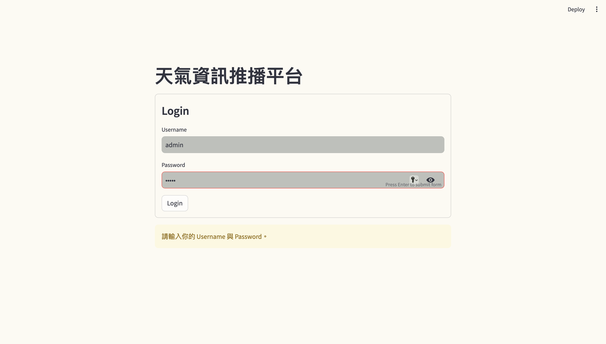

# WEATHER INFORMATION PROMOTION

>  `Streamlit` +  `Crawler(Requests/Selenium)` +  `Model(LDA/Embedding)` +  `Database(MongoDB/Chroma)` =  `Weather Information Promotion Website`

## Website Display
### - Login

### - Homepage

### - Weather Related Quizzes

### - Weather Information Search

### - Settings

## Project Overview
> [!IMPORTANT]
> In this project, I have developed a website based on the package `Streamlit` to demonstrate the `Crawler`, `Database`, and `Model` related skills I've learned.

> Users can log into the website by entering their account credentials.

> Upon initial login, users can navigate through the website's homepage to understand how to use the site.

> Subsequently, users can access the QA page to learn basic weather-related knowledge through a question-and-answer format.

> They can also use the settings page to configure weather inquiries for Taipei City districts.

> Afterward, on the inquiry page, users can input the Taipei City district name they want to check the weather for.
The website will then promptly crawl the corresponding webpage for tommorrow weather information based on the settings and return the results to the user.

## Skills Overview
> [!IMPORTANT]
> This project aims to showcase some of the skills I have mastered. Here's a brief overview of these skills, including `Data Crawling`, `Database Connecting`, and `Models Building`.

> **Data Crawling**: In this project, I utilized both **static web scraping** (using `requests` + `BeautifulSoup`) and **dynamic web scraping** (using `Selenium`) techniques to fetch weather information from the Central Weather Administration and the SMS website.

> **Database Connecting**: In this project, I employed `MongoDB`, a **NoSQL database** to store the information obtained from web scraping. Additionally, I utilized `Chroma` as a **vector database** to store the vectorized data behind the weather knowledge question-and-answer pairs.

> **Models Building**:In this project, I designed the following weather information question-and-answer process to achieve better results:
1. **Preprocess**: Split the question-and-answer pairs from the Central Weather Administration's meteorological knowledge PDF based on question numbers.
2. **LDA**: Utilize an LDA (Latent Dirichlet Allocation) model to categorize the question-and-answer pairs into multiple topic repositories according to different themes.
3. **Embedding**: Use open-source models available on Hugging Face to convert the text of question-and-answer pairs into vectors and store them in Chroma.
4. **Question-and-Answering**: When a user asks a question, the system will determine which topic repository is most relevant to the question and retrieve the question-and-answer pair from that repository that is most closely related to the question for response.
